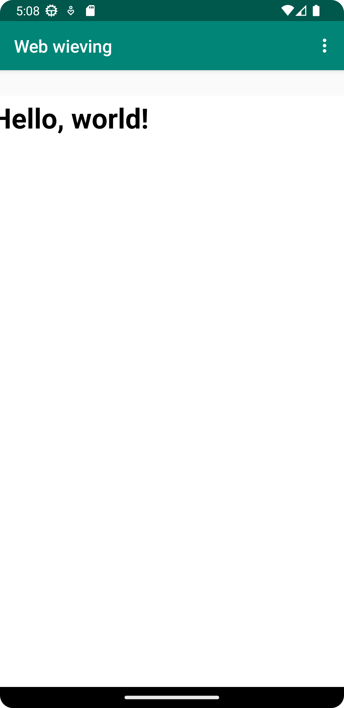

# Rapport

Bytte namn på appen och tilllät internet. Skapade en webview i rätt layout fil, gav den en ID och skrev kod så att den skapas i OnCreate() med rätt ID. Skapade sedan en webviewclient och satte den på webviewen och ändrade dens javascript inställningar. lade till en html länk i string, en väldigt basic html fil i assets foldern och skrev kod så att de laddas när man klickar på dropdown menyn. 


```
<resources>
    <string name="app_name">Web wieving</string>
    <string name="action_external_web">External Web Page</string>
    <string name="action_internal_web">Internal Web Page</string>
    <string name="my_link"><![CDATA[https://simonrydberg.xyz/]]></string>
    <string name="my_link2"><![CDATA[https://student.his.se/]]></string>
</resources>

private WebView myWebView;
private WebViewClient webViewClient;

public void showExternalWebPage(){
    // TODO: Add your code for showing external web page here
    myWebView.loadUrl(getString(R.string.my_link2));
}

public void showInternalWebPage(){
    // TODO: Add your code for showing internal web page here
    myWebView.loadUrl("file:///android_asset/html.html");

}

@Override
protected void onCreate(Bundle savedInstanceState) {
    super.onCreate(savedInstanceState);
    setContentView(R.layout.activity_main);
    Toolbar toolbar = findViewById(R.id.toolbar);
    setSupportActionBar(toolbar);

    myWebView = findViewById(R.id.my_webview);
    myWebView.setWebViewClient(webViewClient);
    myWebView.getSettings().setJavaScriptEnabled(true);

}


if (id == R.id.action_external_web) {
    Log.d("==>","Will display external web page");
    showExternalWebPage();
    return true;
}

if (id == R.id.action_internal_web) {
    Log.d("==>","Will display internal web page");
    showInternalWebPage();
    return true;
}


<WebView
    android:id="@+id/my_webview"
    android:layout_width="411dp"
    android:layout_height="674dp"
    app:layout_constraintBottom_toBottomOf="parent"
    app:layout_constraintEnd_toEndOf="parent" />
    
basic html file
<html lang="en">
<head>
  <meta charset="UTF-8" />
  <title>Hello, world!</title>
  <meta name="viewport" content="width=device-width,initial-scale=1" />
  <meta name="description" content="" />
  <link rel="icon" href="favicon.png">
</head>
<body>
  <h1>Hello, world!</h1>
</body>
</html>

```




